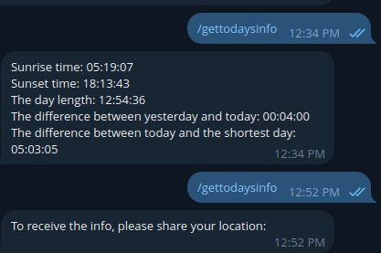
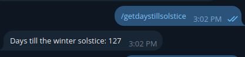
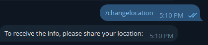
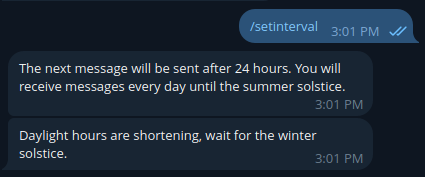
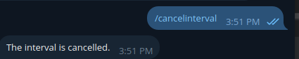

> _Currently offline while being prepared for deployment on a Raspberry Pi._

## About
A simple [Telegram bot](https://t.me/DayIncreaseBot) that tracks the growing daylight from the winter to the summer solstice. It can be used in group chats, where the location should be sent as a reply to the bot’s message: "To receive the info, please share your location:".

It supports these commands:  
- **/gettodaysinfo** – Get today’s daylight info.  
  

  
Show screenshot

  
  
  

- **/getdaystillsolstice** – Show days left until the solstice.  
  

  
Show screenshot

  
  
  

- **/changelocation** – Set or change location.  
  

  
Show screenshot

  
  
  

- **/setinterval** – Set an interval for receiving info. The interval starts at the time when the command is executed, and the message is sent every 24 hours.  
  

  
Show screenshot

  
  
  

- **/cancelinterval** – Cancel receiving messages at the interval.  
  

  
Show screenshot

  
  
  

## Dependencies
- [tgbot-cpp](https://github.com/reo7sp/tgbot-cpp) library  
- [Sunrise-Sunset](https://sunrise-sunset.org/api) API for current sunrise and sunset times  
- [TimeZoneDB](https://timezonedb.com/api) API for timezone information  
- [nlohmann_json](https://github.com/nlohmann/json) for parsing  
- [restclient-cpp](https://github.com/mrtazz/restclient-cpp) for HTTP requests  

## Build Tools
- [Docker](https://hub.docker.com/repository/docker/elsandbox/dayincreasebotcpp/tags) (Linux)  
- CMake  

The bot receives incoming updates via long polling.  

Previously deployed in the cloud (Ubuntu). 
